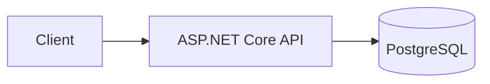
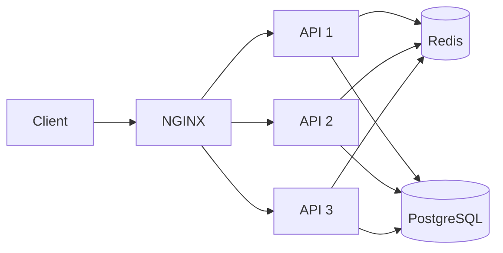
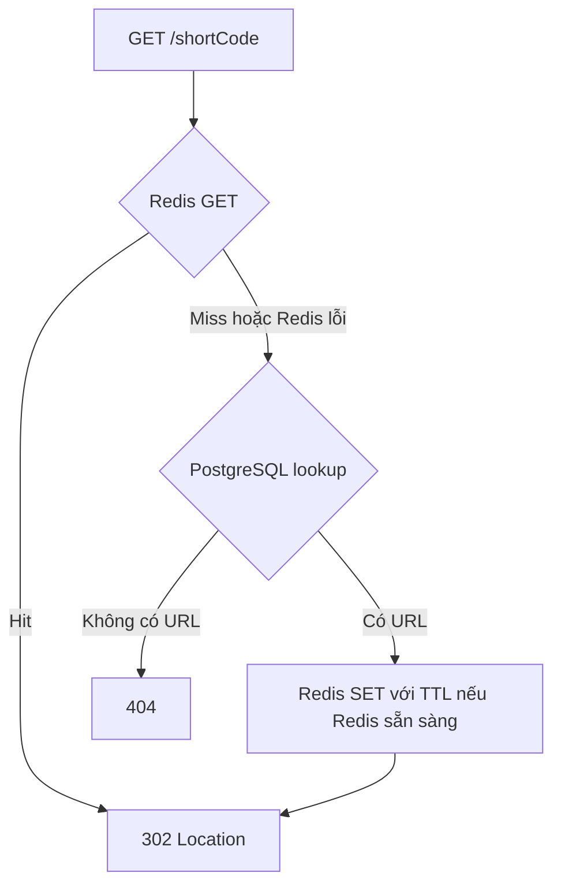
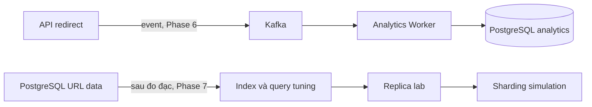

# Phase 0 — Kiến trúc V1 và V2

> Sơ đồ là thiết kế học tập từ [PLAN.md](../PLAN.md) và [bài tham khảo URL shortener](https://medium.com/@sandeep4.verma/system-design-scalable-url-shortener-service-like-tinyurl-106f30f23a82). Mỗi thành phần được thêm ở phase tương ứng sau khi bản trước chạy ổn và được đo. Chưa có hệ thống đang chạy ở Phase 0.

## V1 — Một API, một PostgreSQL (Phase 1)

### Luồng cơ bản

1. **Tạo URL:** API kiểm tra URL, lấy ID từ PostgreSQL sequence, Base62 encode thành `shortCode`, rồi ghi ánh xạ vào PostgreSQL với unique constraint.
2. **Redirect:** API tra mã trong PostgreSQL; tìm thấy thì trả `302 Location: <originalUrl>`, không tìm thấy thì trả `404`.

### Bottleneck và lỗi của V1

| Điểm | Tác động | Dấu hiệu cần đo |
|---|---|---|
| Một API instance | Instance lỗi thì toàn bộ endpoint ngừng phục vụ; không thể tăng năng lực bằng thêm instance nếu chưa có cân bằng tải. | API error rate, CPU, restart, failure test |
| Một PostgreSQL | Mỗi redirect đều lookup DB; DB hoặc kết nối lỗi làm cả create lẫn redirect lỗi. | Query latency, connections, CPU, slow queries |
| Analytics đồng bộ nếu làm trực tiếp | Cập nhật click count trong request sẽ tăng độ trễ hoặc gây tranh chấp ghi trên hot URL. | p95/p99 redirect và DB writes |

Giả định 200 redirect cho mỗi create khiến đường đọc là phần chịu tải lớn. Caching một tập URL nóng có thể giảm số lookup xuống PostgreSQL. Tuy nhiên, dữ liệu URL vẫn phải nằm trong PostgreSQL để giữ tính đúng khi cache mất dữ liệu.

## V2 — Cache và nhiều API instance (Phase 3–4)

### Vì sao thêm từng thành phần

| Thành phần | Thêm khi | Vấn đề được giải quyết | Giới hạn còn lại |
|---|---|---|---|
| Redis cache-aside | Phase 3, sau baseline V1 | Cache hit trả URL gốc mà không query PostgreSQL; cache miss đọc DB rồi điền cache. | Redis lỗi phải fallback DB; hot key và cache hit ratio cần đo. |
| NGINX | Phase 4 | Phân phối request đến nhiều API instance. | Một NGINX đơn vẫn là SPOF; health/failover cần cấu hình và thử nghiệm. |
| API 1–3 stateless | Phase 4 | Một instance lỗi thì các instance còn lại có thể tiếp tục phục vụ; có thể so sánh throughput 1 và 3 instance. | PostgreSQL vẫn là DB chính duy nhất; nhiều API có thể dồn tải vào DB. |

### Redirect với cache-aside

TTL ban đầu trong PLAN là 1 giờ. Xóa URL phải invalidation cache; nếu xóa xảy ra đồng thời với cache miss, cần kiểm thử race để tránh phục hồi entry cũ. Chọn chiến lược cụ thể ở Phase 3. V2 chỉ loại bỏ **single API server** là SPOF; một NGINX, một PostgreSQL và một Redis vẫn có thể hỏng riêng. Không tuyên bố hệ thống đã đạt high availability toàn phần.

## Các bước sau V2

- **Phase 5:** k6, OpenTelemetry, Prometheus và Grafana cho biết cache hoặc thêm API có thật sự cải thiện p95/p99 và throughput không.
- **Phase 6:** Kafka và worker tách công việc thống kê khỏi đường redirect; chính sách khi Kafka unavailable và khả năng mất event phải được xác định trước khi code.
- **Phase 7:** tối ưu index/query và connection pool trước; replica và sharding là lab khi đã có lý do và số đo. Sharding theo numeric ID chỉ định tuyến trực tiếp được với mã Base62 tự sinh; custom alias cần đường tra cứu riêng hoặc quy tắc định tuyến khác.

## Kiểm chứng kiến trúc theo phase

| Phase | Phép thử tối thiểu | Kết luận có thể rút ra |
|---|---|---|
| 1 | Create, `302`, `404`, persistence, Base62 round-trip | Luồng cơ bản đúng |
| 3 | Cache hit/miss, Redis restart/unavailable, delete invalidation | Redis chỉ là cache và fallback đúng |
| 4 | Phân phối request, dừng từng API instance | Không phụ thuộc một API instance |
| 5 | So sánh PostgreSQL only/Redis, 1/3 API bằng cùng kịch bản | Thành phần mới có lợi ích đo được hay không |
| 6 | Dừng analytics worker, tiếp tục redirect, khởi động lại worker | Analytics không chặn redirect và consumer phục hồi |
| 7 | `EXPLAIN ANALYZE`, độ trễ query, replica lag, định tuyến shard | Hiểu bottleneck và trade-off của DB scaling |

